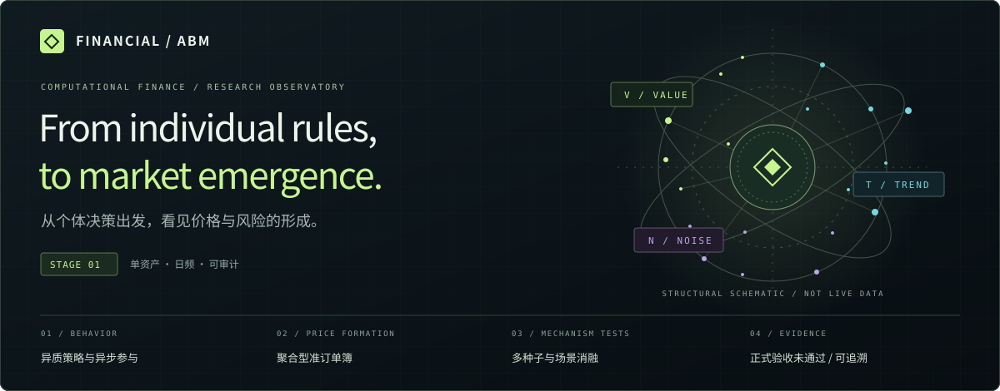
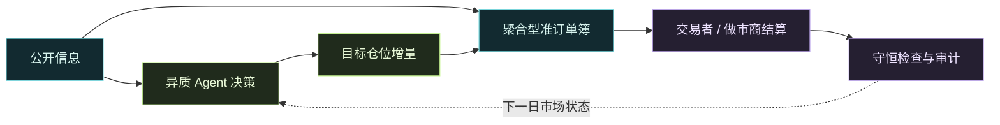

<p align="center">
  
</p>

<p align="center">
  <a href="https://github.com/kanzaler123/financial-ABM/actions/workflows/tests.yml"></a>
  <a href="https://github.com/kanzaler123/financial-ABM/actions/workflows/showcase.yml"></a>
</p>

<p align="center">
  <b>不是预测下一根 K 线，而是理解价格与风险如何从不同决策中产生。</b><br>
  单资产人工金融市场 · 异质投资者 · 机制消融 · 可追溯实验
</p>

<p align="center">
  <a href="showcase/README.md"><b>交互展厅与 Pages 发布</b></a> ·
  <a href="#实验结果不是只有-pass"><b>实验结果</b></a> ·
  <a href="#进入本地实验室"><b>快速开始</b></a> ·
  <a href="OPERATIONS.md"><b>完整操作手册</b></a>
</p>

---

## 市场不是一条曲线，而是一组相互作用的机制

<table>
<tr>
<td width="33%"><h3>◎ 价值 / VALUE</h3>根据主观估值与价格的差异平滑调仓，使用无交易区间避免机械回归。</td>
<td width="33%"><h3>↗ 趋势 / TREND</h3>不同长短窗口形成异质趋势判断，异步参与市场。</td>
<td width="33%"><h3>∿ 噪声 / NOISE</h3>随机需求与持续性交易活动，共同影响聚合订单流。</td>
</tr>
</table>



**展示功能不止折线图。** 独立的 [GitHub 交互展厅](showcase/README.md) 包含可点击机制链路、开发/holdout/正式报告切换、16 场景消融分布对比、22 项验收矩阵、失败检查详解、报告版本追溯与 JSON 导出。深色石墨、荧光绿、冰蓝与浅紫构成统一视觉；支持手机与减少动效设置。仓库 README 使用静态封面和 Mermaid，交互功能在生成的 HTML / GitHub Pages 中运行。

## 实验结果，不是只有 PASS

> [!IMPORTANT]
> **Stage 1 尚未通过正式验收，Stage 2 暂停。**
> 以下为 **2026-08-14 的历史归档**，早于 2026-09-16 的代码审计；不是当前源码重跑结果。代码 CI 通过不能替代模型验收。

| 实验 | 归档检查 | 用途与边界 |
|---|---:|---|
| [开发实验 v14](reports/stage1_structural_dev_v14_20260814/mechanism_report.md) | **22 / 22** | 开发诊断，不决定阶段完成 |
| [未见种子 holdout v13](reports/stage1_structural_holdout_v13_20260814/mechanism_report.md) | **22 / 22** | 留出种子验证，不替代正式验收 |
| [正式验收 v13](reports/stage1_mechanism_acceptance_v13_20260814/mechanism_report.md) | **18 / 22** | 50 种子 × 16 场景；Stage 1 未完成 |

正式报告中尚未通过的四项：**不依赖价格截断、波动聚集与衰减、厚尾稳定性、内生流动性对尾部的贡献**。完整结论见 [final_decision.json](reports/stage1_mechanism_acceptance_v13_20260814/final_decision.json)。历史 GARCH-t 压力对照不是内生涌现证据；报告中的 `+dirty` 代码版本标记在展厅中原样保留。

## 能做什么，不能声称什么

| 模块 | 已有能力 |
|---|---|
| 价格形成 | 聚合型准订单簿，深度、价差、永久 / 暂时冲击和双信息通道 |
| 账户与审计 | 现金 / 股份守恒，持仓约束，配置与版本记录，逐日审计 |
| 策略实验 | value / trend / noise，固定人口基线；Logit 学习作为单独场景 |
| 机制验证 | 多种子消融、配对对照、预热期、检查点与冻结机制 |
| 观察界面 | 本地 Web / 桌面 live、replay、batch；独立的 GitHub 只读展厅 |

当前不是多资产市场、逐笔连续限价订单簿或投资者社交网络；不提供真实交易、PPO、LLM Agent 或公网仿真服务。后续路线以[三阶段开发计划](docs/ABM三阶段开发计划_渐进式学习版.md)为准，不把计划中的能力列为已实现。

## 进入本地实验室

从仓库根目录执行，使用 Python 3.12+。这是本地研究工具，不是公网部署说明。

```sh
python -m venv .venv
# Windows PowerShell: .\.venv\Scripts\Activate.ps1
# macOS / Linux: source .venv/bin/activate
python -m pip install -c requirements-lock.txt -e ".[dev]"
cd web
npm ci
npm run build
cd ..
abm-web --open
```

原版 README 的完整说明原样保留在 [OPERATIONS.md](OPERATIONS.md)，其中历史实验命令需核对对应配置版本。此次展示层工作**不修改 `web/`、`src/abm/`、配置、原始报告或冻结清单**。

<details>
<summary><b>只预览 GitHub 展厅，不安装模型依赖</b></summary>

```sh
python showcase/build.py --output _site
python -m http.server 8080 --directory _site
```

打开 `http://localhost:8080`，或直接打开 `_site/index.html`。纯静态、离线可用；没有运行控制按钮冒充后端模拟。

首次发布 Pages：仓库 **Settings → Pages → Source: GitHub Actions**，然后运行 **GitHub showcase** 工作流。未开启 Pages 时仍生成可下载的离线展厅，发布任务会明确跳过。详见 [展示层文档](showcase/README.md)。

</details>

## 导航

[模型源码](src/abm) · [实验报告](reports) · [配置与协议](configs) · [开发路线](docs/ABM三阶段开发计划_渐进式学习版.md) · [完整操作手册](OPERATIONS.md) · [展示层维护](showcase/README.md)

---

<sub>Financial ABM · Research prototype. 可检查的机制，可追溯的证据。非投资建议。</sub>
